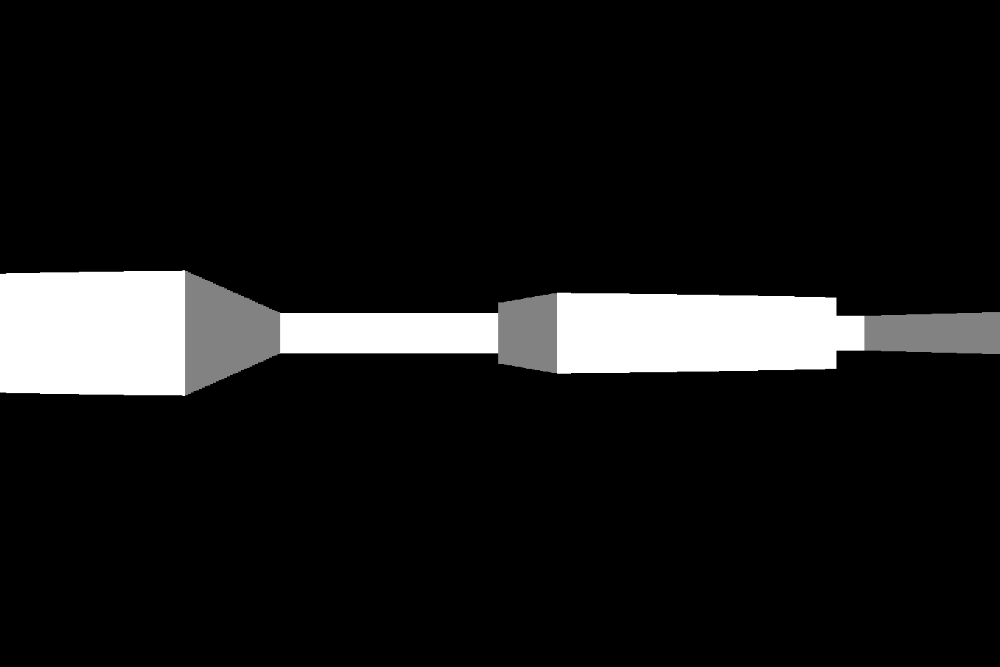

# Boom | 2.5D Raycasting Engine in Rust


A 2.5D raycasting engine written in Rust from scratch. This project renders a 3D-style perspective from a 2D map, inspired by classic games like Wolfenstein 3D.



## Features

*   **Raycasting Renderer**: Renders a 3D perspective from a simple 2D tile-based map.
*   **DDA Algorithm**: Implements a Digital Differential Analyzer (DDA) algorithm for efficient ray-wall intersection calculations.
*   **Player Movement**: Includes first-person controls for movement (forward/backward, strafing) and rotation.
*   **Collision Detection**: Simple AABB-style collision detection to prevent the player from walking through walls.
*   **Projection Math**: Corrects for fisheye lens distortion to create a natural-looking perspective.

## Getting Started

### Prerequisites

Ensure you have the Rust toolchain installed. You can install it from [rustup.rs](https://rustup.rs/).

### Running the Project

1.  Clone the repository:
    ```sh
    git clone https://github.com/shivkr6/boom.git
    cd boom
    ```

2.  Build and run the project in release mode for the best performance:
    ```sh
    cargo run --release
    ```

## Controls

*   **↑ / ↓**: Move forward / backward
*   **← / →**: Rotate left / right

## License

This project is licensed under the MIT License. See the [LICENSE](LICENSE) file for details.
